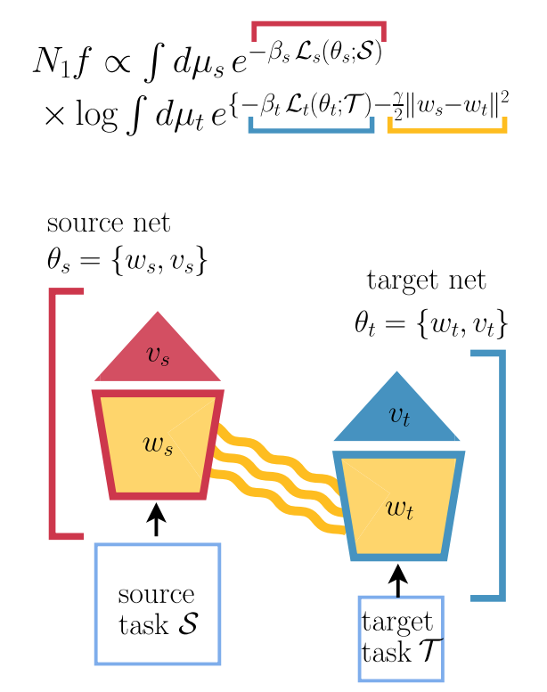
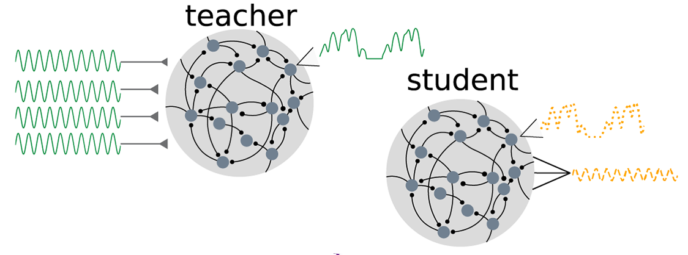
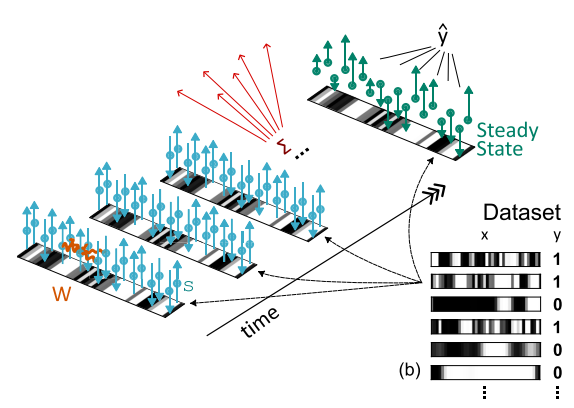
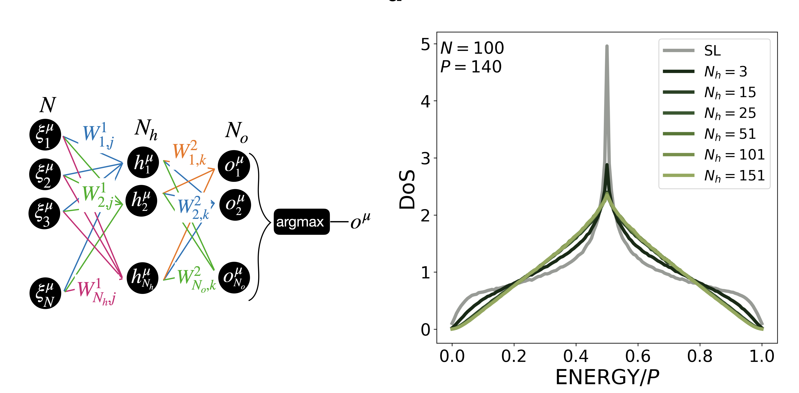

Our group seeks to understand how computation emerges from the 
complex dynamics and connectivity of artificial and biological systems.

We employ a variety of approaches rooted in statistical physics and applied math.

## Statistical mechanics of deep learning

We are focused on understanding the typical learning and generalization performance of neural networks. To do so, we use tools from statistical physics of disordered systems (replica method) and random matrix theory.
In collaboration with the group of [Federica Gerace](https://www.unibo.it/sitoweb/federica.gerace/en) and [Pietro Rotondo](https://personale.unipr.it/en/ugovdocenti/person/246194), we are currently developing a theory for transfer and multi-task learning in Bayesian deep networks.

We are also particularly interested in understanding the impact of constraints on computation, deriving fundamental bounds for the function of biologically-plausible neural networks.

 

Suggested reading:
* [Statistical Mechanics of Transfer Learning in Fully Connected Networks in the Proportional Limit](https://journals.aps.org/prl/abstract/10.1103/PhysRevLett.134.177301), A. Ingrosso et al, Physical Review Letters (2025)
* [Data-driven emergence of convolutional structure in neural networks](https://www.pnas.org/doi/abs/10.1073/pnas.2201854119), A. Ingrosso and S. Goldt, PNAS (2022)
* [Optimal learning with excitatory and inhibitory synapses](https://journals.plos.org/ploscompbiol/article?id=10.1371/journal.pcbi.1008536), A. Ingrosso, PLOS Computational Biology (2020)
* [Subdominant Dense Clusters Allow for Simple Learning and High Computational Performance in Neural Networks with Discrete Synapses](https://journals.aps.org/prl/abstract/10.1103/PhysRevLett.115.128101), C. Baldassi et al, Physical Review Letters (2015)

## Dynamics and learning in recurrent neural networks

We use concepts and methods from statistical physics and control theory to analyze learning in recurrent neural networks. We are recently focused on understanding quantitatively the role of heterogeneity in RNNs, using both dynamical mean field theory and numerical approaches.

In parallel, we build data-driven models for neural population dynamics, using large-scale recordings in behaving animals performing tasks. I co-developed 
I am currently working in collaboration with [Timo Kerkoele's lab](https://www.neuroscience.vision/) and [Wouter Kroot](https://www.ru.nl/personen/kroot-w).
 

Suggested reading:
* [Input correlations impede suppression of chaos and learning in balanced firing-rate networks](https://journals.plos.org/ploscompbiol/article?id=10.1371/journal.pcbi.1010590), R. Engelken et al, PLOS Computational Biology (2022)
* [A Disinhibitory Circuit for Contextual Modulation in Primary Visual Cortex](https://www.cell.com/neuron/fulltext/S0896-6273(20)30891-6), A.J. Keller et al, Neuron (2020)
* [Training dynamically balanced excitatory-inhibitory networks
](https://journals.plos.org/plosone/article?id=10.1371/journal.pone.0220547), A. Ingrosso and L.F. Abbott, PLOS One (2019)

## Efficiency of neural computation

Our recent focus is on the efficiency of neural computation from both an information theoretic and energetic perspective. Using methods from Stochastic Thermodynamics, I recently formulated a computation-dissipation bottleneck for stochastic recurrent neural networks operating at the mesoscale.

The aim of my group is to develop a mathematical formalism to better understand fundamental tradeoffs between computation and energy consumption in both rate and spiking networks performing function.
 

Suggested reading:
* [Machine learning at the mesoscale: A computation-dissipation bottleneck](https://journals.aps.org/pre/abstract/10.1103/PhysRevE.109.014132), A. Ingrosso and E. Panizon

## Multiscale methods for neural networks

We use advanced Monte Carlo methods borrowed from Soft Matter Physics to analye the geometrical properties of the loss landscape of neural network learning problems. We are currently developing novel optimal coarse graining methods to understand the structure of internal representations of trained neural networks.

This work is mainly carried out in collaboration with the group of [Raffaello Potestio](https://sbp.physics.unitn.it/raffaello-potestio/) at [UniTn](https://www.physics.unitn.it/en). 
 

Suggested reading:
* [Density of states in neural networks: an in-depth exploration of learning in parameter space
](https://openreview.net/forum?id=BLDtWlFKhn), M. Mele et al